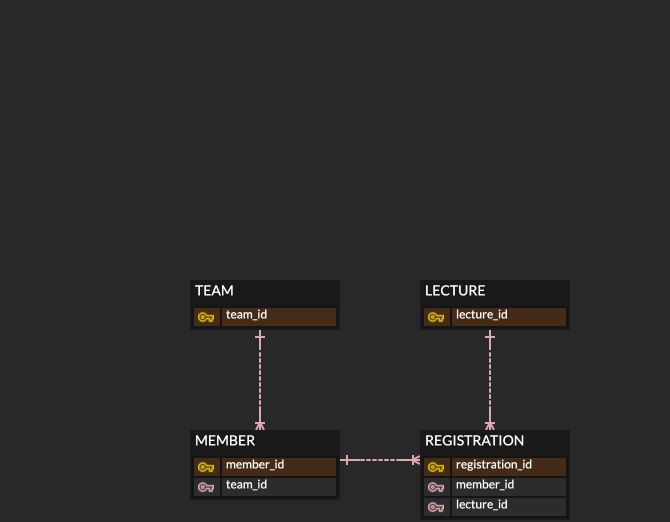

# ex2025_1
example - 2025 cs

# team members
- DK, P
  - Team leader
  - Tasks
    - create project
    - create member entity, repository, serivce, test, api
    - ....
- AB, C
  - Team member
  - Tasks
    - create team entity, ...

# erd link

# table create script

